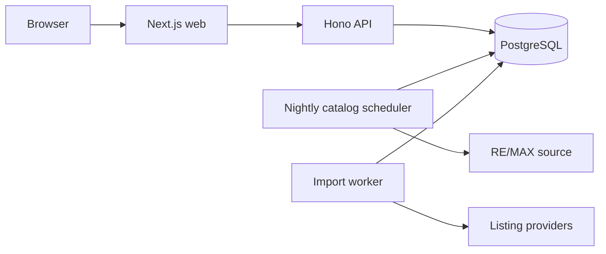

# ADR 0008: Harden the modular monolith before scaling

## Status

Accepted

## Context

The curated catalog adds public reads, scheduled ingestion, normalized geography, administrative review, and shared properties to the existing personal-search application. The first implementation exposed duplicated frontend presentation, weak operational targets, retry gaps, and relational fields whose hierarchy was only enforced in application code.

## Decision

Keep one Next.js application, one Hono API, independent import/catalog worker processes, and one PostgreSQL database. Harden that deployment by:

- server-rendering public catalog content while retaining client-side interactive filters;
- sharing public API contracts and property presentation/filter primitives;
- isolating administrative catalog routes from personal property routes;
- enforcing geography hierarchy and property location normalization in PostgreSQL;
- scheduling import retries and exposing catalog freshness status;
- using exact reconciliation for config-managed administrators;
- adopting the targets and recovery runbook in `docs/architecture/non-functional-requirements.md`.

## Alternatives considered

- **Split catalog into a microservice:** stronger isolation, but duplicates authentication, deployment, observability, and transaction coordination before traffic justifies it.
- **Adopt Redis and a queue immediately:** improves distributed scheduling, but adds an operational dependency while a PostgreSQL-backed queue meets the documented scale envelope.
- **Keep all consistency in application code:** simpler migrations, but permits invalid catalog-source hierarchies and drift between normalized and display locations.

## Consequences

- Public pages have useful HTML before hydration and share stable contracts with the API.
- Database constraints reject inconsistent location writes from every code path.
- Workers remain simple and restartable, with bounded retry behavior.
- The single database remains the main availability boundary; daily backups and restore exercises are required.
- PostgreSQL polling and substring search must be reevaluated before exceeding 10,000 active catalog listings or 100 concurrent users.
